# 소셜 미디어 텍스트를 이용한 트랜스포머 기반 정신질환 분류 모델 개발

---

2022-1 소프트웨어융합캡스톤디자인

소프트웨어융합학과 이예령

## 0. 과제요약

---

Reddit에 있는 정신질환관련 커뮤니티의 게시물을 통해 분류모델을 학습하고, 분류를 진행한다. 

분류는 5가지 질병에 대해 진행하며, control text로 정신질환과 관련이 없는 텍스트로 이루어진 class 하나도 추가한다. 

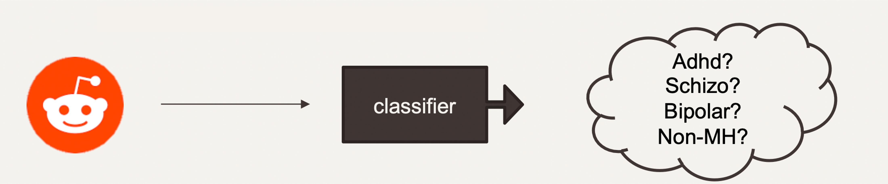

아래 colab의 코드를 통해 제일 성능이 좋았던 모델로 직접 텍스트를 해볼 수 있다.

[https://colab.research.google.com/drive/1f7G2eeXGE8oFCqtY5SGWf53bheeiXxaL?usp=sharing](https://colab.research.google.com/drive/1f7G2eeXGE8oFCqtY5SGWf53bheeiXxaL?usp=sharing)

## 1. 과제개요

---

### 가. 과제 설계 배경 및 필요성

 보건복지부에 따르면 주요 정신장애 평생 유병률은 27.8%로, 4명 중 1명이 평생동안 한번 이상 정신질환을 겪는 것으로 나타났다. 특히, 2020년 코로나의 발병으로 전 세계적으로 우울증과 불안증 유병률이 2배가량 중가했다. 거의 모든 사람이 스마트폰을 가지고 있는 요즘 시대에, 사람들은 소셜 미디어에 친숙하기 때문에 익명으로 마음을 털어놓는 경우가 많고, 이를 통해 적기에 빠른 진단으로 치료를 할 수 있다. 따라서 정신질환 분류 모델 개발을 주제로 선정했다. 

### 나. 과제 주요내용

과제의 주요 내용은 여러 소셜 미디어 텍스트 중에서 주요 정신 질환을 detect 하는 것이다. 모델훈련을 위한 데이터셋으로 익명성이 보장되고 많은 사용자가 사용하는 reddit의 게시글을 사용한다. Reddit의 주제 중 주요 정신질환에 관련한 주제를 선별하여 게시글을 수집한다.
(ADHD:r/ADHD, 정신분열증:r/schizophrenia, 양극성 기분장애:r/bipolar, 우울장애:r/depression, 불안장애:r/anxiety)

그리고 정신질환과 관련이 없는 주제(fitness, meditation, parenting, relationships, teaching, jokes 등)의 게시물도 수집한다. 데이터를 전처리하고, 트랜스포머 기반 모델을 수립하여 훈련시킨다. 그 후 성능평가를 진행한다.

### 다. 최종결과물의 목표

1. 같은 데이터셋으로 진행한 기존 연구 (82%) 보다 성능 향상을 목표로 한다.
2. 새로운 소셜 미디어 텍스트 데이터를 넣었을 때, 정신질환이 있는지 없는지, 또 있다면 어떤 정신질환이 의심되는지 예측할 수 있는 것을 목표로 한다.

## 2. 과제 수행방법

---

사용한 데이터는 Reddit 게시물의 제목 + 본문내용이다.
구글 코랩을 이용하여 베이스 코드를 작성하였고,
학교 GPU를 대여하여 BERT모델에 대한 fine-tuning을 실시하였다.

### 가. 크롤링

크롤링에 사용한 API는 PSAW로, 2012.01.01. ~ 2021.12.31. 까지의 데이터를 수집하였다. * 2013년은 API로 크롤링되지 않아 archived된 자료를 이용

### 나. 필터링

이후 직접 선정한 필터링 단어를 통해 자신이 진단받았다고 자가보고한 텍스트를 골라내었다. 필터링 단어는 다음과 같다.

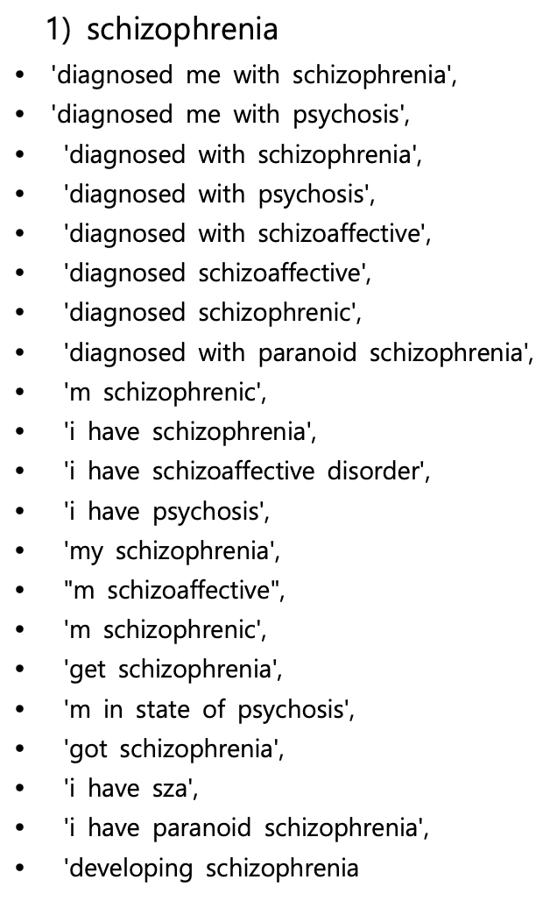

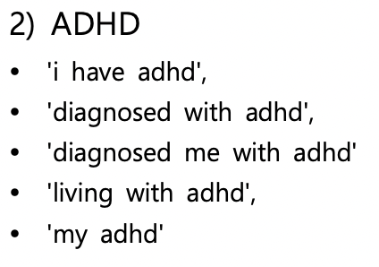

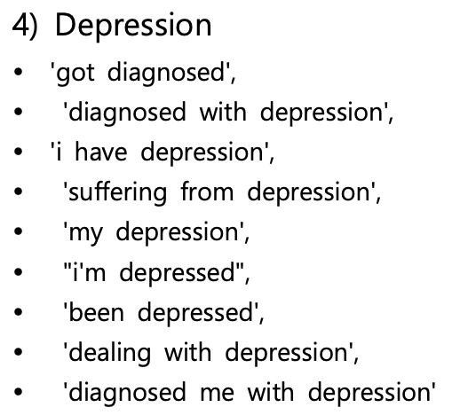

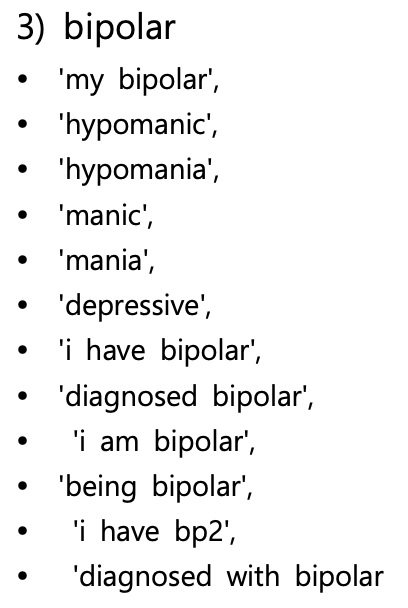

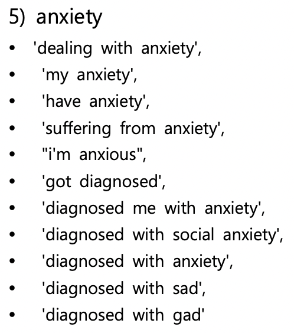

필터링의 기준은 일반적으로 쓰는 말 (i was diagnosed with ~~) 과 각 커뮤니티를 직접 살펴본 후 자신이 진단받았다고 표현할 때 자주 쓰는 말을 선별해서 선정했다.다다. 

### 다. 모델훈련

pre-trained BERT모델을 사용하기 위해, **transformers, dataset** 라이브러리를 활용하였다.
앞에서 필터링된 데이터 중 각 클래스별 5300개를 샘플링해 총 **31800개의 데이터셋**을 만들었고,
80%는 training set, 10%는 validation set, 10%는 test set으로 나누어 진행했다.

1전이학습 기법 중 동결방식과 미세조정방식을 모두 사용해보았고, 더 성능이 좋았던 미세조정 방식을 선택했다.

(동결방식: BERT의 마지막 hidden state를 feature로 사용하여 logisic regression을 훈련.
미세조정방식: BERT의 마지막에 분류를 하는 레이어를 추가하여 모델 파라미터 전체를 훈련. )

미세조정의 base가 되는 모델로는 다음을 선택했다.

- BERT-base-uncased
- BERT-base-cased
- ELECTRA
- ALBERT
- RoBERTa

각 모델 별로 동일하게 lr=5e-05, batch_size=8, optimizer는 adam으로 하여 10epoch을 훈련시켰다.
최종적으로 validation loss가 가장 낮았던 체크포인트를 불러와서 선택했다. 

### 라. Evaluation

1. test set으로 각 모델의 성능(accuracy, recall, precision, f1-score)을 측정했다.
2. Reddit의 데이터만 사용했기 때문에 다른 텍스트를 사용할 때도 비슷한 성능을 보일지 평가하기 위해 twitter의 텍스트 데이터를 가지고 cross-flatform 테스트를 진행했다. 트위터 데이터도 reddit 데이터와 동일한 방법으로 필터링하였다. ADHD, schizophrenia에 대한 데이터는 찾을 수 없어서 4개의 class로만 진행했다.

## 3. 수행결과

---

### 가. 과제수행 결과

1. 동결방식 vs. 미세조정방식 (필터링 되지 않은 데이터 사용)
    
    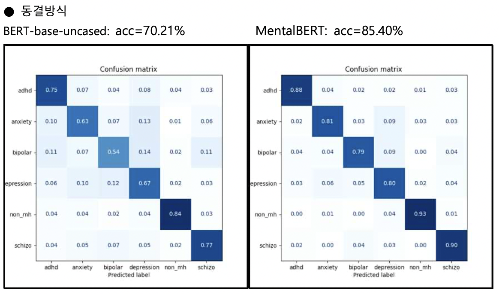
    
    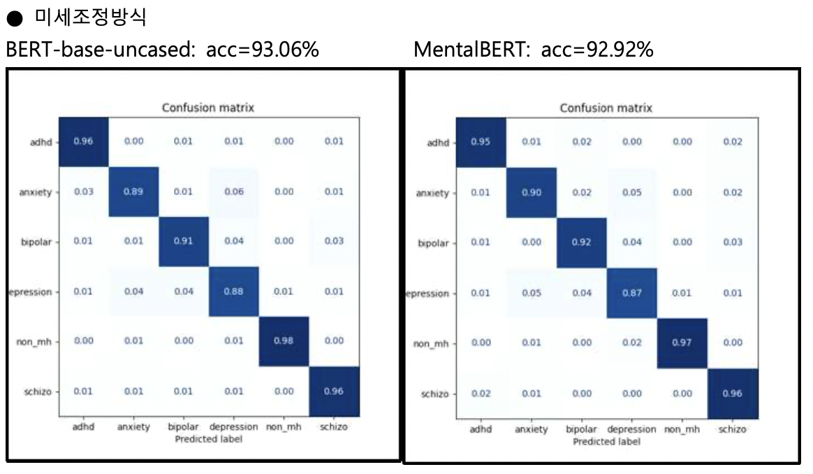
    
2. 미세조정방식으로 여러 가지 모델 비교 (필터링 된 데이터 사용)
    
    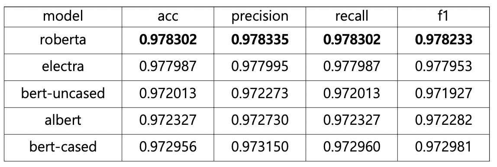
    
    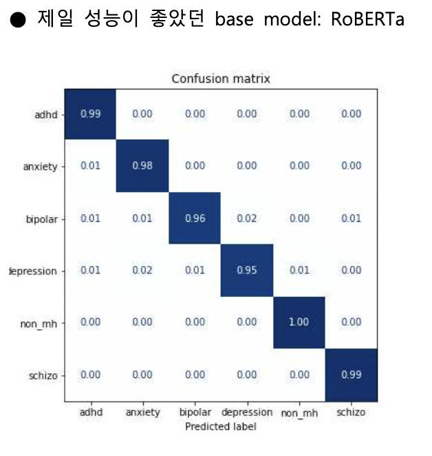
    
3. Twitter data로 진행한 cross-flatform evaluation

RoBERTa

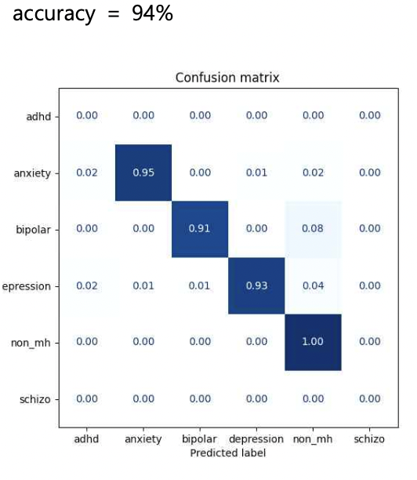

## 나. 최종결과물 주요특징 및 설명

전체적으로 control set인 non-mental health를 제일 잘 분류했으며, 정신질환 중에서는 adhd, schizophrenia가 잘 분류가 되었다.

다른 class와 비교했을 때, anxiety, bipolar, depression끼리 잘못 분류되는 경우가 많았다.

1. 동결방식 vs. 미세조정방식

처음에 사용한 모델은 BERT-base-uncased와 MentalBERT이다.

여기서 MentalBERT는 BERT-base-uncased에서 추가적으로 reddit의 Mental health관련 데이터를 훈련시킨 모델이다.

 첫 번째로 동결방식에서는 큰 차이로 MentalBERT가 성능이 더 좋았다. 이것은 이 연구에서 사용한 데이터와 동일한 플랫폼에서 비슷한 도메인(정신질환관련)의 데이터를 사용하여 훈련된 BERT이기 때 문에 텍스트에서 더 좋은 feature를 찾았다고 할 수 있다.

 두 번째로 미세조정방식에서는 BERT와 MentalBERT 모두 비슷한 accuracy를 보여주었다. 이 결과로 같은 구조의 모델에서는 사전에 데이터를 추가훈련을 해도 미세조정을 거치면 성능이 비슷해진다는 것을 발견했다. 따라서 이후 진행할 때 데이터를 추가훈련시킨 모델보다는 BERT-base와 구조나 학습 방법이 다른 모델을 사용해야겠다는 생각을 했다.

 미세조정방식이 93%정도로 85%의 성능을 보인 동결방식보다 우수하다고 생각했기 때문에 이후의 연구는 미세조정방식으로 진행되었다.

1. 미세조정방식으로 여러 모델 비교

여러 모델 중에서는 RoBERTa와 ELECTRA가 성능이 좋았다. 기본모델인 BERT-base가 성능이 가장 낮았다.

 제일 성능이 좋았던 RoBERTa의 confusion matrix를 살펴봤을 때, 전체적으로 잘 분류가 된 모습을 볼 수 있었다. non_mh가 잘 분류되고 anxiety, bipolar, depression이 비교적 덜 잘 분류되는 경향도 앞의 결과와 같았다.

1. Cross-flatform evaluation

 anxiety, bipolar, depression, non_mh 4개의 class로 진행한 트위터 데이터에 대한 결과값은 94%로 Reddit 데이터에 대한 성능보다는 낮지만 그래도 괜찮은 성능을 보였다. 이 결과는 이 분류기가 reddit이 아닌 다른 플랫폼에 대해서도 어느 정도 성능을 보일 수 있다는 가능성을 보여주었다.

## 5. 기대효과 및 활용방안

---

### 가. 기대효과

- 소셜 미디어에 게시되는 수많은 텍스트 중 정신질환 위험이 있는 텍스트를 빨리 찾아내어 빠른 대처와 치료를 할 수 있다.
- 상담가나 의사에게 직접 말하기 부담스러운 사람도 자가진단을 할 수 있다.

### 나. 활용방안

- 다른 정신질환 텍스트 데이터를 추가하여 지금보다 더 다양한 분류를 할 수 있다.
- 자살 위험이 있는 텍스트 데이터를 추가하여 자살위험군을 분류할 수 있다.
- 트위터의 데이터로 cross-flatform test를 했을 때, 94%로 괜찮은 성능을 보였기 때문에, 트위터 api를 이용해서 실시간으로 정신질환이 의심되는 텍스트가 얼마나 있는지 분석을 할 수 있다.

## 6. 결론 및 제언

---

 이번 캡스톤디자인에서 작성자는 Reddit의 text data를 이용하여 글을 쓴 사람이 어떤 정신질환을 보유하고 있는지 분류하는 분류기를 만들었다. 분류기로는 transformer계열의 BERT 모델을 사용하였고, 여러 모델 중 가장 성능이 좋았던 모델은 fine-tuning된 RoBERTa 모델이었다. accuracy는 97.8%로, 연구 초에 목표했던 82% (Bi-LSTM)를 웃도는 수치이다.

 이 분류기가 reddit의 텍스트에만 한정적으로 적용되지 않다는 것을 보이기 위해 twitter의 텍스트를 가져와서 evaluation을 진행했고, 94%의 accuracy를 보여주었다.

 다만, 이 연구에서는 실제로 정신질환 진단을 받은 텍스트를 골라내기 위해 필터링을 사용하였고 필 터링을 한 데이터에는 질병명이 포함되어 있기 때문에 필터링으로 인해 분류가 더 쉬워졌을수도 있다 는 생각을 했다. 그래서 질병명을 삭제하거나 ‘disease’로 바꾸어 훈련을 시도했으나 오히려 질병명이 포함된 reddit text는 잘 분류하지 못하는 모습을 보였다. 따라서 질병명도 하나의 큰 특징이라고 결론을 내렸다.

 따라서 이후 연구에서는 질병명이 들어가지 않은 텍스트로 일반화 성능을 끌어올릴 수 있는 방법을 찾고싶다. 왜냐하면 일반적으로 정신과의사의 진료는 환자의 자가보고에 의존하는데, 환자가 먼저 ‘저는 OO으로 진단받았습니다’라는 표현을 쓰지 않기 때문이다. 따라서 질병명이 들어가지 않고 자신의 상태를 서술하는 텍스트로 성능이 좋은 분류기를 만든다면, 그 분류기가 정신과에 쉽게 가지 못하는 사람들에게 좋은 자가진단 툴이 될 것이라 생각한다.

### 참고자료

---

Ashish Vaswani, Noam Shazeer, Niki Parmar, Jakob Uszkoreit, Llion Jones, Aidan N. Gomez, Lukasz
Kaiser, Illia Polosukhin (2017). Attention Is All You Need.
Jacob Devlin, Ming-Wei Chang, Kenton Lee, Kristina Toutanova. BERT: Pre-training of Deep
Bidirectional Transformers for Language Understanding (2018)
Jinhyuk Lee, Wonjin Yoon, Sungdong Kim, Donghyeon Kim, Sunkyu Kim, Chan Ho So and Jaewoo
Kang. BioBERT: a pre-trained biomedical language representation model for biomedical text mining
(2019)
Emily Alsentzer 외 6명. Publicly Available Clinical BERT Embeddings (2019)
Shaoxiong Ji, Tianlin Zhang, Luna Ansari, Jie Fu, Prayag Tiwari, and Erik Cambria. MentalBERT:
Publicly Available Pretrained Language Models for Mental Healthcare (2021)
Lewis Tunstall 외 2명. Natural Language Processing with Transformers (2022). O’Reilly Media.
이상윤, 이원희 (2021). 소셜미디어에서 정신질환을 예측하기 위한 텍스트 분류 알고리즘 비교 평가.
한국정보과학회 학술발표논문집, 1723-1725.
국립정신건강센터, 2021년 정신건강실태조사보고서. (2021)
유원준 외 1명. 딥 러닝을 이용한 자연어 치리 입문. https://wikidocs.net/book/2155 (2022.06.15.)